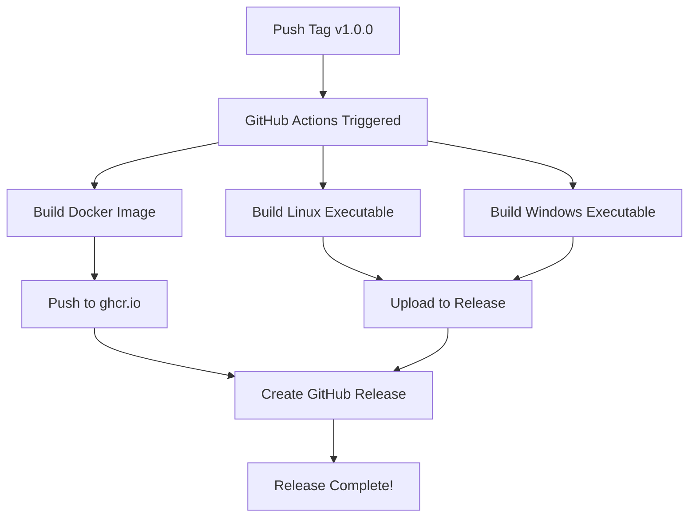

# Deployment Guide - AI Image Tagger

This guide explains how to deploy and release new versions of AI Image Tagger automatically.

## 🚀 Quick Release

### Option 1: Automated Script (Easiest)

```bash
# Make the script executable (first time only)
chmod +x release.sh

# Create a release
./release.sh 1.0.0

# Create a pre-release (beta, alpha, etc.)
./release.sh 1.0.0-beta prerelease
```

This automatically:
1. Commits your changes
2. Pushes to GitHub
3. Creates and pushes a git tag
4. Triggers GitHub Actions to build everything
5. Creates a GitHub release with all artifacts

### Option 2: Manual Tag Push

```bash
# Commit your changes
git add .
git commit -m "Ready for release v1.0.0"
git push

# Create and push tag
git tag v1.0.0
git push origin v1.0.0
```

GitHub Actions will automatically build and release.

### Option 3: GitHub Web Interface

1. Go to **Actions** tab
2. Click **Build and Release** workflow
3. Click **Run workflow**
4. Enter version (e.g., `v1.0.0`)
5. Select release type (release/prerelease)
6. Click **Run workflow**

## 📦 What Gets Built

When you create a release, GitHub Actions automatically builds:

### 1. 🐳 Docker Image
- **Registry:** GitHub Container Registry (ghcr.io)
- **Tags:**
  - `ghcr.io/yourusername/ai-image-tagger:1.0.0`
  - `ghcr.io/yourusername/ai-image-tagger:1.0`
  - `ghcr.io/yourusername/ai-image-tagger:1`
  - `ghcr.io/yourusername/ai-image-tagger:latest`
- **Size:** ~5-7GB
- **Platforms:** linux/amd64

### 2. 🐧 Linux Executable
- **File:** `ai-image-tagger-linux.tar.gz`
- **Size:** ~2-3GB compressed
- **Attached to:** GitHub Release

### 3. 🪟 Windows Executable
- **File:** `ai-image-tagger-windows.zip`
- **Size:** ~2-3GB compressed
- **Attached to:** GitHub Release

## 🔄 Release Workflow



## 🐳 Using Docker Releases

### Pull and Run

```bash
# Pull latest version
docker pull ghcr.io/yourusername/ai-image-tagger:latest

# Run with GPU support
docker run --gpus all -p 5000:5000 ghcr.io/yourusername/ai-image-tagger:latest

# Or use docker-compose
docker-compose up -d
```

### Update to New Version

```bash
# Pull new version
docker pull ghcr.io/yourusername/ai-image-tagger:1.1.0

# Stop old container
docker-compose down

# Update docker-compose.yml to use new version
# Then start
docker-compose up -d
```

## 💻 Using Executable Releases

### Download from GitHub

1. Go to [Releases](https://github.com/yourusername/ai-image-tagger/releases)
2. Download for your platform:
   - Linux: `ai-image-tagger-linux.tar.gz`
   - Windows: `ai-image-tagger-windows.zip`
3. Extract and run

### Users receive:
- Standalone executable (no Python needed)
- Frontend files
- Documentation

## 🔐 GitHub Container Registry Access

### Make Images Public

By default, images are private. To make them public:

1. Go to your GitHub profile
2. Click **Packages**
3. Select `ai-image-tagger`
4. Click **Package settings**
5. Scroll to **Danger Zone**
6. Click **Change visibility** → **Public**

### Pull Private Images

```bash
# Login with personal access token
echo $GITHUB_TOKEN | docker login ghcr.io -u USERNAME --password-stdin

# Pull image
docker pull ghcr.io/yourusername/ai-image-tagger:1.0.0
```

## 📋 Release Checklist

Before creating a release:

- [ ] All tests pass locally
- [ ] Updated version in documentation
- [ ] Updated CHANGELOG (if you have one)
- [ ] Committed all changes
- [ ] Reviewed code changes
- [ ] Tested Docker build locally (optional)

### Test Docker Build Locally

```bash
# Build
docker build -t ai-image-tagger:test .

# Test run
docker run --gpus all -p 5000:5000 ai-image-tagger:test

# Test frontend
open http://localhost:5000
```

## 🏷️ Version Numbering

Follow [Semantic Versioning](https://semver.org/):

- **Major (X.0.0)**: Breaking changes
- **Minor (x.Y.0)**: New features, backward compatible
- **Patch (x.y.Z)**: Bug fixes, backward compatible

### Examples:
- `v1.0.0` - Initial release
- `v1.1.0` - Added new model
- `v1.1.1` - Fixed bug
- `v2.0.0` - Redesigned API (breaking)
- `v1.0.0-beta` - Pre-release beta
- `v2.0.0-rc1` - Release candidate

## 🔍 Monitoring Builds

### View Progress

1. Go to repository on GitHub
2. Click **Actions** tab
3. Click on latest workflow run
4. See real-time build logs

### Build Times

- Docker build: ~15-20 minutes
- Linux executable: ~15-20 minutes
- Windows executable: ~15-20 minutes
- **Total:** ~20-30 minutes (parallel builds)

### If Build Fails

1. Check Actions logs for error
2. Fix the issue in code
3. Delete failed release: `gh release delete v1.0.0`
4. Delete tag: `git tag -d v1.0.0 && git push origin :refs/tags/v1.0.0`
5. Try again

## 🚨 Troubleshooting

### Docker Build Fails

```bash
# Test locally first
docker build -t test .

# Check Dockerfile syntax
docker build --no-cache -t test .
```

### PyInstaller Build Fails

```bash
# Test locally
./build-executable.sh

# Check logs in GitHub Actions
```

### Release Already Exists

```bash
# Delete release
gh release delete v1.0.0

# Delete tag locally and remotely
git tag -d v1.0.0
git push origin :refs/tags/v1.0.0

# Try again
./release.sh 1.0.0
```

## 🔄 Rollback

### Rollback Docker

```bash
# Pull previous version
docker pull ghcr.io/yourusername/ai-image-tagger:1.0.0

# Update docker-compose.yml
# Then restart
docker-compose restart
```

### Rollback Git

```bash
# Revert to previous tag
git checkout v1.0.0

# Or create new release from old code
git checkout v1.0.0
./release.sh 1.0.2
```

## 🎯 Best Practices

1. **Test locally before releasing**
2. **Use semantic versioning**
3. **Write clear commit messages**
4. **Keep CHANGELOG updated**
5. **Tag releases properly (v1.0.0, not 1.0.0)**
6. **Don't delete old releases** (users may depend on them)
7. **Use pre-releases for testing** (beta, alpha, rc)

## 📊 Release Strategy

### Development Workflow

```
main branch (stable)
  └─> tag v1.0.0 → Release 1.0.0
  └─> tag v1.1.0 → Release 1.1.0
  └─> tag v2.0.0-beta → Pre-release 2.0.0-beta
  └─> tag v2.0.0 → Release 2.0.0
```

### Recommended Process

1. **Development**: Work on feature branches
2. **Testing**: Merge to `main` after testing
3. **Pre-release**: Tag as `v1.0.0-beta` for testing
4. **Release**: Tag as `v1.0.0` when ready
5. **Hotfix**: Create patch version `v1.0.1`

## 🔗 Useful Commands

```bash
# List all tags
git tag -l

# View latest release
gh release view

# List all releases
gh release list

# Download release assets
gh release download v1.0.0

# Delete a release
gh release delete v1.0.0

# View Docker images
docker images | grep ai-image-tagger

# Clean old Docker images
docker image prune -a
```

## 📚 Additional Resources

- [GitHub Actions Documentation](https://docs.github.com/en/actions)
- [GitHub Container Registry](https://docs.github.com/en/packages/working-with-a-github-packages-registry/working-with-the-container-registry)
- [Docker Documentation](https://docs.docker.com/)
- [Semantic Versioning](https://semver.org/)

---

**Questions?** Open an issue or check the main [README.md](README.md)
